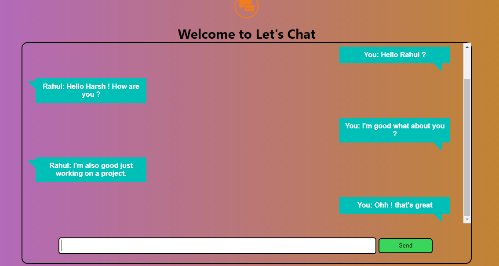

# Lets Chat- Realtime Chat Application Using Node Js and Socket.io
# Introduction
This is an anonymous chat app.

# Concepts Used
<ul>
  <li>HTML</>
  <li>JavaScript</>
  <li>Node JS</>
  <li>Socket.io</>
</ul>

# Installation
<ul>
  <li>1. npm install</>
  <li>2. node ./app.js</>
</ul>
Then goto your browser and open index.html.\n Note : Node Server will run on 8002 port make sure this port is not used by any other application.

Inspiration:- CodeWithHarry.
